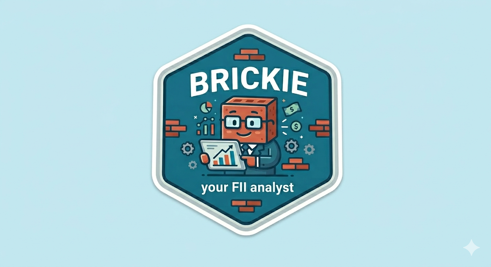

<div align="center">



# Brick by Brick

### *"Tijolo por tijolo, construindo riqueza."*

**A Python CLI for analyzing and tracking Brazilian Real Estate Investment Funds (FIIs) — using only primary, public, and free data sources.**

[](https://python.org)
[](LICENSE)
[](ROADMAP.md)
[]()

</div>

---

## What is Brick by Brick?

**Brick by Brick** is a Python CLI for collecting, analyzing, and tracking Brazilian Real Estate Investment Funds (FIIs). The name is a pun on "Tijolo por Tijolo" — the Portuguese term for real-estate-backed FIIs — and reflects the philosophy of building a solid investment portfolio one brick at a time.

The project is built on a single principle: **no third-party scrapers, no paid APIs, no fragile dependencies**. Every data point comes directly from official government sources that are legally required to publish this information.

---

## Meet Brickie


**Brickie** is your no-nonsense FII analyst. He reads CVM filings, crunches B3 price data, checks BCB benchmark rates, and tells you which bricks are worth adding to your portfolio — and which ones have cracks.

---

## How to Use

See **[USAGE.md](USAGE.md)** for the full usage guide, including:

- Installation and first run
- Finding FIIs with the screener
- Researching a FII with `info` and `compare`
- Building and tracking your portfolio
- Setting up automatic alerts and scheduled updates

**Quick start:**

```bash
pip install -r requirements.txt

# 1. Download all data (CVM + B3 + BCB) — ~5 min, ~200 MB
python main.py update

# 2. Screen FIIs
python main.py screen --dy-min 9 --pvp-max 1.05

# 3. Inspect a FII
python main.py info HGLG11                    # indicators + DY history + trends + PL growth
python main.py info HGLG11 --pvp-hist         # + 24-month P/VP chart
python main.py info HGLG11 --yoc-alvo 150     # + YoC projected at R$ 150 entry price

# 4. Build your portfolio — manually or via Excel import
python main.py portfolio add HGLG11 100 165.50 2024-06-15
python main.py portfolio template              # generate carteira_template.xlsx
python main.py portfolio import carteira.xlsx  # bulk import from Excel
python main.py portfolio report                # monthly report (uses correct month's prices)
python main.py portfolio dividends             # dividend history, YoC and payback
python main.py portfolio allocation            # capital allocation by ticker and segment
python main.py portfolio income --meses 12     # monthly dividend income chart
python main.py portfolio watch HGLG11 --preco-alvo 150  # add to watchlist
python main.py portfolio watchlist             # show watchlist with live indicators
```

---

## Why only primary sources?

Sites like Fundamentus, Status Invest, and Funds Explorer are great products — but they are third-party businesses. They can change their HTML, add CAPTCHAs, block scrapers, go offline, or shut down. Our data pipeline would break with them.

Everything we need is already publicly available from the official regulators:

| Source | What we get | URL |
|--------|-------------|-----|
| **CVM** | FII registry, monthly reports (DY, VPA, PL, composition) | `dados.cvm.gov.br` |
| **B3** | Historical daily prices (COTAHIST) — all FIIs since 1986 | `bvmf.bmfbovespa.com.br` |
| **BCB** | SELIC, CDI, IPCA time series (benchmark) | `api.bcb.gov.br` |

All of these are plain `requests.get()` calls — no authentication, no rate limiting, no scraping.

---

## Indicators

| Indicator | Source | Notes |
|-----------|--------|-------|
| Monthly DY | CVM Informe Mensal | `Percentual_Dividend_Yield_Mes` |
| NAV / VPA | CVM Informe Mensal | `Valor_Patrimonial_Cotas` |
| Market price | B3 COTAHIST | `PREULT`, filter `CODBDI == "12"` |
| **P/VP** | B3 ÷ CVM | Market price / NAV — calculated, not fetched |
| **P/VP history** | B3 + CVM | Monthly series, 24-month window, with avg/min/max |
| **DY 12m** | CVM | Sum of 12 monthly DY values (stored as decimal fraction, e.g. 0.0066 = 0.66%) |
| **DY trend (MM6/12/24)** | CVM | Rolling means with direction signals — detects declining distributions |
| **Spread vs SELIC** | CVM + BCB | DY 12m − SELIC accumulated 12m |
| **Dividend history** | CVM + B3 | Monthly dividend per unit = DY × closing price; reconstructed from trade history |
| **YoC (Yield on Cost)** | Portfolio | Dividend received ÷ acquisition cost — more honest than quoted DY |
| **Payback** | Portfolio | Acquisition cost ÷ avg monthly dividend (last 6m) — in months |
| Liquidity (30d avg) | B3 COTAHIST | `VOLTOT` 30-day mean |
| DY consistency | CVM | Std. dev. of monthly DY — lower is more stable |
| PL growth (12m/24m) | CVM | Net asset value variation — signals whether the fund is raising capital |
| Revenue composition | CVM | CRI, LCI, real estate income as % of NAV (last 3 months) |
| Admin fee | CVM Informe Mensal | `Percentual_Despesas_Taxa_Administracao` |
| SELIC / CDI / IPCA | BCB SGS | Benchmark for return comparison |

---

## Architecture

```
brick-by-brick/
├── src/
│   ├── collectors/
│   │   ├── cvm_cadastro.py      # FII registry — cad_fi.csv
│   │   ├── cvm_inf_mensal.py    # Monthly reports — DY, VPA, PL, composition
│   │   ├── b3_cotahist.py       # Historical market prices — COTAHIST
│   │   ├── bcb_series.py        # SELIC, CDI, IPCA — BCB API SGS
│   │   └── cvm_inf_diario.py    # Daily NAV — collected, not yet used in production
│   ├── storage/
│   │   └── database.py          # SQLite schema, upserts, migrations
│   ├── analysis/
│   │   ├── indicadores.py       # P/VP, DY trends, P/VP history, PL growth, composition
│   │   └── screener.py          # Weighted score filter and ranking
│   └── portfolio/
│       ├── carteira.py          # Position management, P&L, dividend history
│       ├── relatorio.py         # Terminal reports: positions, allocation, income, dividends
│       ├── alertas.py           # Alert checks and screener opportunities
│       └── grupamentos.py       # Split/reverse-split detection and correction
├── data/                        # Local data — gitignored
│   └── brickbybrick.sqlite      # SQLite database
├── main.py                      # CLI entry point (Typer)
├── requirements.txt
├── ROADMAP.md                   # Full development plan and schema reference
├── USAGE.md                     # Usage guide and command reference
├── business_analysis.md         # Analyst workflow gap assessment and M5 plan
└── CASE_STUDY.md                # End-to-end fictional use case (educational)
```

---

## Stack

```
requests      # HTTP — CVM, B3, BCB
pandas        # DataFrames and CSV parsing
numpy         # Numerical calculations
sqlite3       # Local relational database (stdlib)
typer         # CLI framework
rich          # Terminal tables and colors
schedule      # Lightweight job scheduler
openpyxl      # Excel template generation and import
```

> No Plotly, no Jupyter, no Parquet, no Jinja2. Everything runs in the terminal.

---

## Roadmap

| Milestone | Scope | Status |
|-----------|-------|--------|
| **M1 — Foundation** | Data collection (CVM + B3 + BCB) + SQLite storage | ✅ Complete |
| **M2 — Analysis** | Indicators, screener, `info`, `compare` | ✅ Complete |
| **M3 — Portfolio** | Positions, P&L, dividend history, split correction, alerts, scheduler | ✅ Complete |
| **M4 — Deeper analysis** | Historical P/VP, DY trends, segment allocation, watchlist, income projection | ✅ Complete |
| **M5 — Analytical enrichment** | Segment analysis, watchlist alerts, income projection, PDF enrichment via Claude API | 🔲 Next |
| **M6 — Interface** | GUI (web or desktop) — scope TBD after M5 | 🔲 Future |

See [ROADMAP.md](ROADMAP.md) for full details and [business_analysis.md](business_analysis.md) for the analytical gap assessment.

---

## License

MIT — see [LICENSE](LICENSE) for details.

---

<div align="center">

*"O mercado pode ser irracional por mais tempo do que você pode permanecer solvente — então analise os tijolos antes de comprar."*

**Brick by Brick — build wealth, one FII at a time.**

</div>
